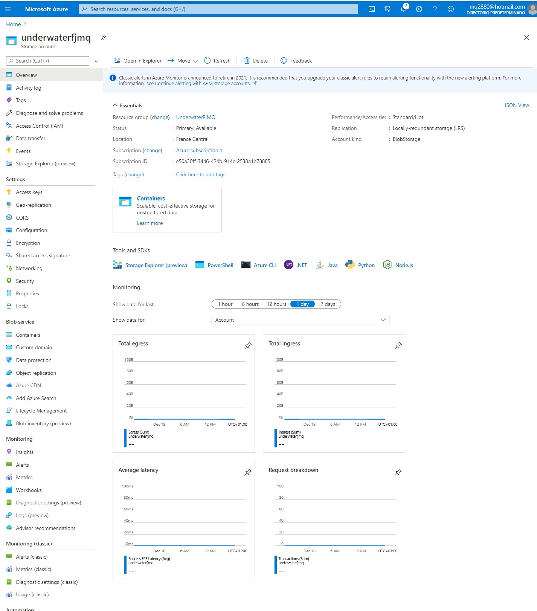
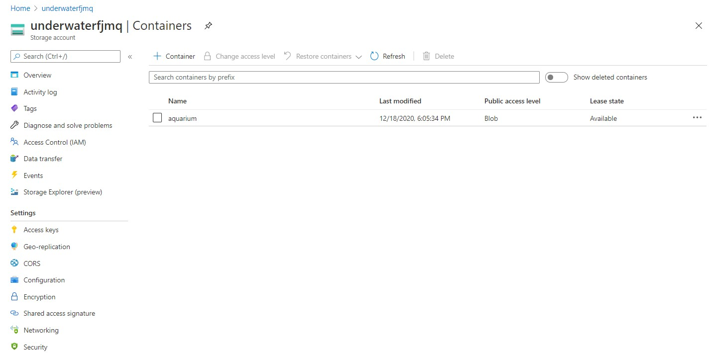
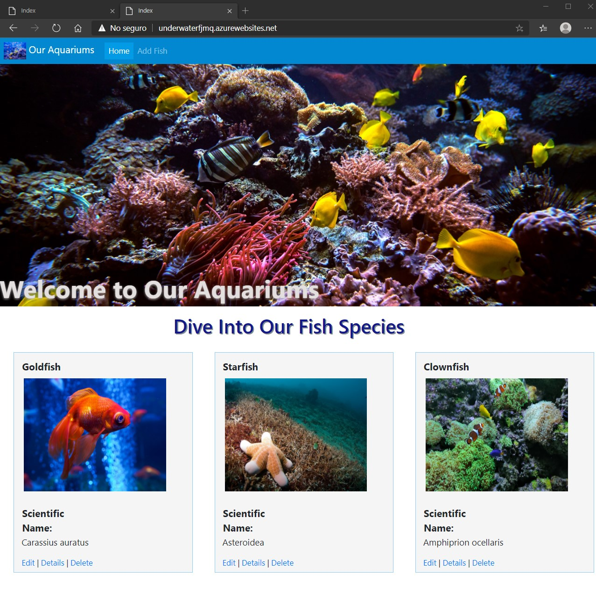
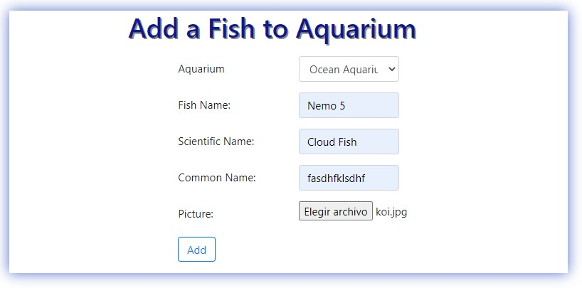
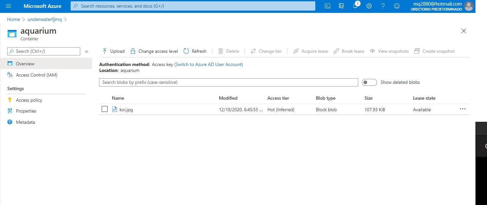

# Module 14: Hosting and Deployment

## Lab: Hosting and Deployment

1. **Nombres y apellidos:** Francisco Javier Moreno Quevedo
2. **Fecha:** 28/12/2020
3. **Resumen del Ejercicio:** subir una imagen a Azure
4. **Dificultad o problemas presentados y como se resolvieron:** Ninguna

Ejercicio  2: Upload an Image to Azure Blob Storage

- Creamos una storage Account con el nombre underwaterfjmq

  

  

  
- creamos un container con el nombre aquarium

  

  

  

  


- Añadimos el contenedor al appsettings.json

- EN la clase **Fish.cs** incluimos la propiedad ImageURL

- Esta propiedad la incluimos en las vistas de **details.cshtml**, **Edit.cshtml**, **Create.cshtml** y **Delete.cshtml**

- Añadimos el paquete **WindowsAzure.Storage** al proyecto

- En **UnderwaterRepository.cs** incluimos el codigo para que suba y borre una imagen a azure en la accion RemoveFish y AddFish

- Añadimos una nueva migración del modelo

  ```cs
       Add-Migration AddFishImageURL
  ```

- Actualizamos la base de datos

  ```cs
       Update-Database
  ```

- Publicamos 




- Añadimos un pez




- comprobamos


